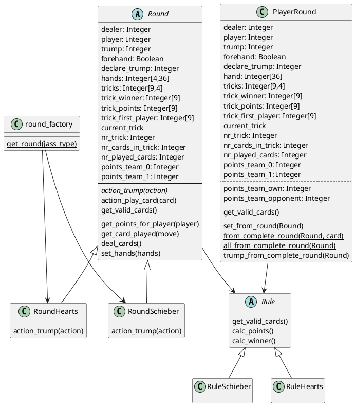

```plantuml

@startuml
abstract class Round {
dealer: Integer
player: Integer
trump: Integer
forehand: Boolean
declare_trump: Integer
hands: Integer[4,36]
tricks: Integer[9,4]
trick_winner: Integer[9]
trick_points: Integer[9]
trick_first_player: Integer[9]
current_trick
nr_trick: Integer
nr_cards_in_trick: Integer
nr_played_cards: Integer
points_team_0: Integer
points_team_1: Integer
---
{abstract} action_trump(action)
action_play_card(card)
get_valid_cards()
..
get_points_for_player(player)
get_card_played(move)
deal_cards()
set_hands(hands)
}

class RoundSchieber {
action_trump(action)
}

class RoundHearts {
action_trump(action)
}


class PlayerRound {
dealer: Integer
player: Integer
trump: Integer
forehand: Boolean
declare_trump: Integer
hand: Integer[36]
tricks: Integer[9,4]
trick_winner: Integer[9]
trick_points: Integer[9]
trick_first_player: Integer[9]
current_trick
nr_trick: Integer
nr_cards_in_trick: Integer
nr_played_cards: Integer
points_team_0: Integer
points_team_1: Integer
..
points_team_own: Integer
points_team_opponent: Integer
---
get_valid_cards()
..
set_from_round(Round)
{static} from_complete_round(Round, card)
{static} all_from_complete_round(Round)
{static} trump_from_complete_round(Round)
}

class  round_factory {
{static} get_round(jass_type)
}


abstract class Rule {
get_valid_cards()
calc_points()
calc_winner()
}

class RuleSchieber {
}

class RuleHearts {
}

Round <|-- RoundSchieber
Round <|-- RoundHearts
Rule <|-- RuleSchieber
Rule <|-- RuleHearts
Round --> Rule
PlayerRound --> Rule

round_factory --> RoundSchieber
round_factory --> RoundHearts
@enduml
```